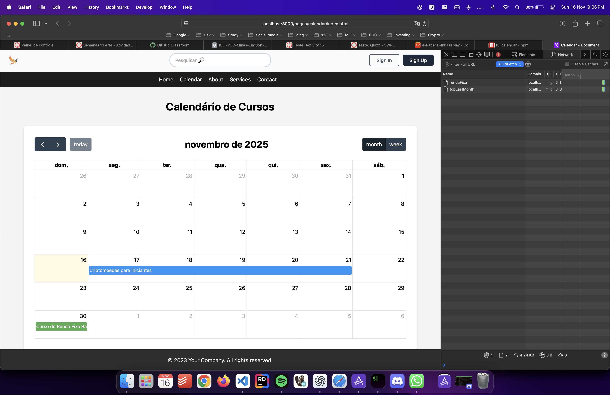
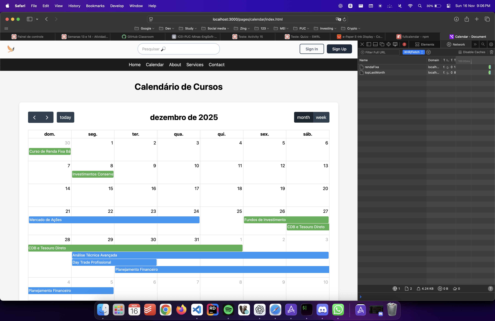

# Trabalho Prático 07 - Semanas 13 e 14

A partir dos dados cadastrados na etapa anterior, vamos trabalhar formas de apresentação que representem de forma clara e interativa as informações do seu projeto. Você poderá usar gráficos (barra, linha, pizza), mapas, calendários ou outras formas de visualização. Seu desafio é entregar uma página Web que organize, processe e exiba os dados de forma compreensível e esteticamente agradável.

Com base nos tipos de projetos escohidos, você deve propor **visualizações que estimulem a interpretação, agrupamento e exibição criativa dos dados**, trabalhando tanto a lógica quanto o design da aplicação.

Sugerimos o uso das seguintes ferramentas acessíveis: [FullCalendar](https://fullcalendar.io/), [Chart.js](https://www.chartjs.org/), [Mapbox](https://docs.mapbox.com/api/), para citar algumas.

## Informações do trabalho

- Nome:Guilherme Henrique Morei
- Matricula: 855826
- Proposta de projeto escolhida: Aplicacao web de cursos (similar a udemy e alura)
- Breve descrição sobre seu projeto:

**Print da tela com a implementação**

<< Coloque aqui uma breve explicação da implementação feita nessa etapa>>
1 - fiz refactor da atividade anterior passando os dados para jsonserver e serem populados atraves dos endpoints
2 - Criei nova pagina de calendario
3 - populei o calendario com servico que busca todos os cursos

<<  COLOQUE A IMAGEM TELA 1 AQUI >>

<<  COLOQUE A IMAGEM TELA 2 AQUI >>

